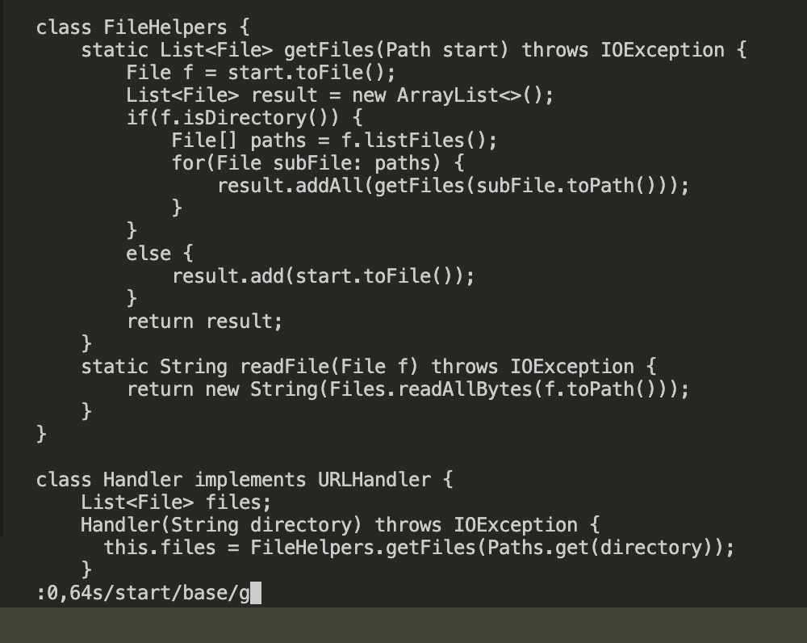
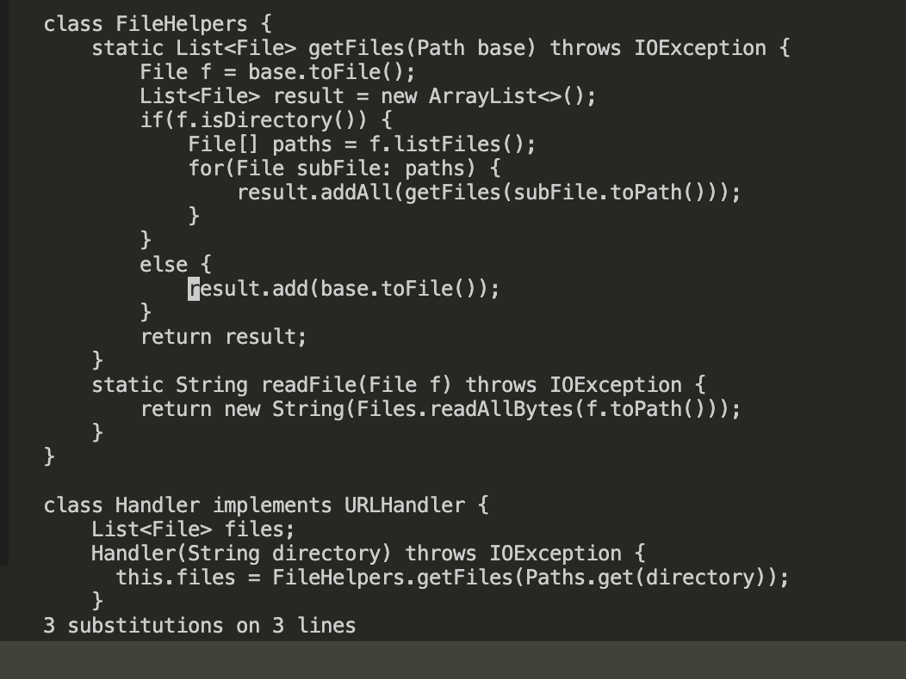

## Part 1 task: Changing the name of the start parameter and its uses to base
key strokes:

`:0,64s/start/base/g<Enter>:wq<Enter>`

`:0,64s` : after going into vim, we type this command, which indicates to search whatever is entered next and replace every occurance within line 0 to line 64 with the next word separated by a slash "/". The reason that we gave it a range is so that we don't change anything outside the class like main.

`/start/base/g<Enter>`: this combo replaces every occurance of "start" by "base" in this document. The 'g' means to search all elements in this document.

(immediately before typing out the above commands)

(immediately after typing out the above commands)

`:wq<Enter>`:saving and exit vim
___

## Part 2: timing yourself

1. edit in local, scp the file, run it in ssh: 
_2 minutes 40 seconds_

2. edit in ssh, exit vim, and test there:
_1 minute 5 secdons_

`Which of these two styles would you prefer using if you had to work on a program that you were running remotely, and why?:`

definitely the second one, simply because scp takes too long.

`What about the project or task might factor into your decision one way or another? (If nothing would affect your decision, say so and why!):`

nothing would effect my decision, because even if scp doesn't take as long, just typing the command for scp would be more time-consuming than editing in remote server. We are not going to have scp commands in every single computer's command history
